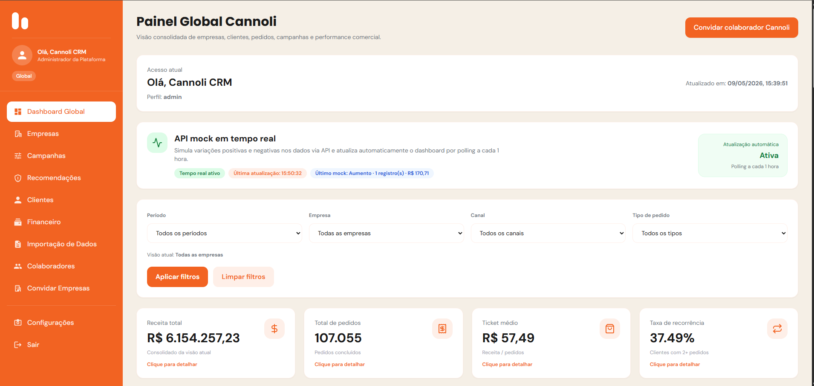

# FECAP - Fundação de Comércio Álvares Penteado

<p align="center">
  <a href="https://www.fecap.br/">
    
  </a>
</p>

# Dashboard de Indicadores Cannoli - TechSnack DevTeam
<p align="center">
  
</p>

## 👥 Grupo: TechSnack DevTeam

## Integrantes

* **[Esther Oliveira Costa](https://www.linkedin.com/in/estherolvr/)**
* **[Higor Luiz Fonseca dos Santos](https://www.linkedin.com/in/higor-fonseca-santos/)**
* **[João Victor de Faria](https://www.linkedin.com/in/joaovictordefaria/)**

## 📚 Professores Orientadores

* **[Eduardo Savino Gomes](https://www.linkedin.com/in/eduardo-savino/)**
* **[Lucy Mari Tabuti](https://www.linkedin.com/in/lucymari/)**
* **[Maurício Lopes da Cunha](https://www.linkedin.com/in/maureen-leung-5630492a/)**
* **[Rodnil da Silva Moreira Lisboa](https://www.linkedin.com/in/professorrodnil/)**
* **[Victor Bruno Alexander Rosetti de Quiroz](https://www.linkedin.com/in/victorbarq/)**

---

## 📌 Sobre o Projeto

O **Dashboard de Indicadores Cannoli** é uma plataforma web desenvolvida para centralizar, processar e visualizar dados comerciais da Cannoli, transformando informações operacionais em indicadores estratégicos para tomada de decisão.

A aplicação permite acompanhar métricas relacionadas a empresas, clientes, pedidos, campanhas, desempenho financeiro, recorrência, ticket médio, crescimento de receita e alertas estratégicos. O projeto também conta com uma API mock em tempo real, que simula variações positivas e negativas nos dados para atualizar os painéis automaticamente.

O objetivo principal é oferecer uma visão gerencial clara, visual e acionável, permitindo que usuários administrativos, colaboradores e empresas parceiras acompanhem seus principais KPIs de forma simples, responsiva e integrada.

---

## 🚀 Principais Funcionalidades

* Dashboard global com visão consolidada da plataforma.
* Painel administrativo com indicadores comerciais, operacionais e financeiros.
* Visualização de empresas cadastradas.
* Gestão e análise de clientes.
* Análise de campanhas e desempenho por canal.
* Indicadores financeiros, como receita total, ticket médio, margem simulada, descontos e caixa estimado.
* Recomendações estratégicas baseadas em recorrência, ticket médio, conversão e desempenho de campanhas.
* Segmentação de clientes por comportamento de compra.
* Análise RFM simplificada.
* Exportação de detalhamentos em **CSV** e **PDF**.
* API mock em tempo real para simulação de aumento e redução de indicadores.
* Processamento de dados via Python.
* Integração com banco de dados MySQL/MariaDB.
* Sistema de login com perfis de acesso.
* Convites para empresas e colaboradores.
* Interface responsiva desenvolvida em React.

---

## 🧩 Tecnologias Utilizadas

### Frontend

* React
* Vite
* JavaScript
* Tailwind CSS
* Recharts
* Lucide React
* jsPDF
* jsPDF AutoTable

### Backend

* Node.js
* Express
* MySQL/MariaDB
* JWT
* Bcrypt
* Nodemon

### Processamento de Dados

* Python
* Pandas
* NumPy

### Banco de Dados

* MySQL/MariaDB
* MySQL Workbench
* XAMPP

---

## 🛠 Estrutura de Pastas

```txt
Raiz
|
|-- documentos
|   |-- Entrega 1
|   |   |-- Análise Inferencial de Dados
|   |   |-- Contabilidade e Finanças
|   |   |-- Engenharia de Software e Arquitetura de Sistemas
|   |
|   |-- Entrega 2
|       |-- Análise Inferencial de Dados
|       |-- Contabilidade e Finanças
|       |-- Engenharia de Software e Arquitetura de Sistemas
|
|-- imagens
|
|-- src
|   |-- Entrega 1
|   |   |-- Backend
|   |   |-- Frontend
|   |
|   |-- Entrega 2
|       |-- Backend
|       |   |-- config
|       |   |-- controllers
|       |   |-- data
|       |   |-- database
|       |   |-- middlewares
|       |   |-- models
|       |   |-- python
|       |   |   |-- painel_admin
|       |   |       |-- __init__.py
|       |   |       |-- builder.py
|       |   |       |-- cli.py
|       |   |       |-- config.py
|       |   |       |-- filters.py
|       |   |       |-- recommendations.py
|       |   |       |-- rfm.py
|       |   |       |-- utils.py
|       |   |-- routes
|       |   |-- services
|       |   |-- utils
|       |   |-- app.js
|       |   |-- server.js
|       |   |-- package.json
|       |
|       |-- Frontend
|           |-- public
|           |-- src
|               |-- componentes
|               |   |-- admin
|               |   |-- constants
|               |   |-- dashboard
|               |   |-- login
|               |   |-- sections
|               |   |-- services
|               |   |-- utils
|               |-- main.jsx
|
|-- README.md
|-- .gitignore
```


## 💻 Configuração para Desenvolvimento

### Pré-requisitos

Antes de começar, certifique-se de ter instalado:

- [Node.js](https://nodejs.org/)
- [MySQL](https://www.mysql.com/) ou [XAMPP](https://www.apachefriends.org/)
- [MySQL Workbench](https://www.mysql.com/products/workbench/) *(opcional, mas recomendado)*

---

### 🗄️ 1. Configuração do Banco de Dados

1. Abra o MySQL (ou inicie o XAMPP e ative o módulo MySQL).
2. Crie um novo banco de dados.
3. Localize o arquivo `.sql` disponível no projeto.
4. Execute o script dentro do banco criado — ele irá importar todas as tabelas e dados necessários.

---

### ⚙️ 2. Rodando o Backend

Abra um terminal, acesse a pasta `backend` e execute:

```bash
cd backend
npm install
npm run dev
```
---

### 🖥️ 3. Rodando o Frontend

Abra **outro terminal**, acesse a pasta `frontend` e execute:

```bash
cd frontend
npm install
npm run dev
```

Após iniciar, acesse o sistema pela URL exibida no terminal do frontend.

---

### 🔐 Credenciais de Acesso Padrão

| Campo | Valor |
|-------|-------|
| **Email** | `admin@cannolicrm.com` |
| **Senha** | `Admin@123` |

---

### 🏢 Como a Plataforma Funciona

**Cadastro de Colaboradores Cannoli**

1. Acesse a aba de **colaboradores**.
2. Realize o cadastro do colaborador.
3. O sistema gera um **código de acesso**.
4. O colaborador utiliza esse código para efetuar login na plataforma.

**Cadastro de Empresas Parceiras**

1. A Cannoli envia um **convite por e-mail** para a empresa parceira.
2. O acesso ao sistema só é liberado através desse convite.
3. Sem o convite, a empresa não conseguirá acessar a plataforma.

---

## 📋 Licença/License
<a href="https://github.com/2026-1-NCC4/Projeto2">TechSnack dev Team</a> © 2026 by <a href="https://github.com/2026-1-NCC4/Projeto3">TechSnack dev Team<</a> is licensed under <a href="https://creativecommons.org/licenses/by/4.0/">CC BY 4.0</a>

## 🎓 Referências

Aqui estão as referências usadas no projeto.

1. Cannoli. Plataforma de CRM, fidelização e inteligência de dados para foodservice. Disponível em: <https://www.cannoli.food/>
2. Nielsen Norman Group. *Dashboards: Making Charts and Graphs Easier to Understand*. Disponível em: <https://www.nngroup.com/articles/dashboards-preattentive/>
3. Microsoft Learn. *Tips for designing a great Power BI dashboard*. Disponível em: <https://learn.microsoft.com/en-us/power-bi/create-reports/service-dashboards-design-tips>
4. React. Documentação oficial. Disponível em: <https://react.dev/>
5. Node.js. Documentação oficial. Disponível em: <https://nodejs.org/>
6. MySQL. Documentação oficial. Disponível em: <https://www.mysql.com/>
7. Pandas. Documentação oficial. Disponível em: <https://pandas.pydata.org/>
